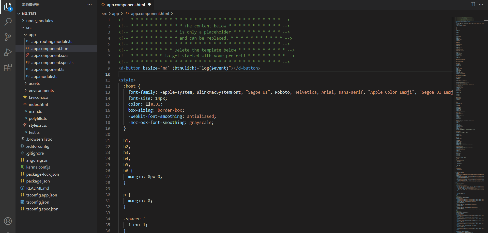
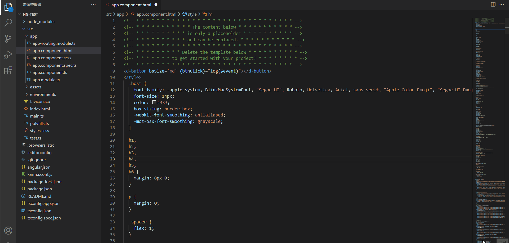

<a href="https://devui.design/home" target="_blank" rel="noopener noreferrer">

  
 
  
  
  
  

<h1 align="center">DevUIHelper for DevUI Component</h1>

## Plug-in Features

### Completing Tips
Provides the automatic code completion function for components and instructions, automatically supplements mandatory parameters, and provides information about all APIs supported by components and instructions for selection.

### Hover Information 
Hovers show information about the symbol/object that's below the mouse cursor, including application scenarios, supported API lists, and API details.

### Code error correction
- Alerts when devui content is used and devui is not installed.
- Alarm if no necessary entry is made under the devui tab.

## Development and Debugging
- Run `npm install` in the root directory.
- Run `npm run compile` to compile client and server
- Switches to the debug view.
- Select `Launch Client` from the drop-down list.
- Run the startup configuration.
- If you also want to debug the server, use the startup configuration `Attach to Server`

## Contribution

You are welcome to contribute your code or discuss your great ideas!

Thanks to all the contributors who helped us build DevUI
