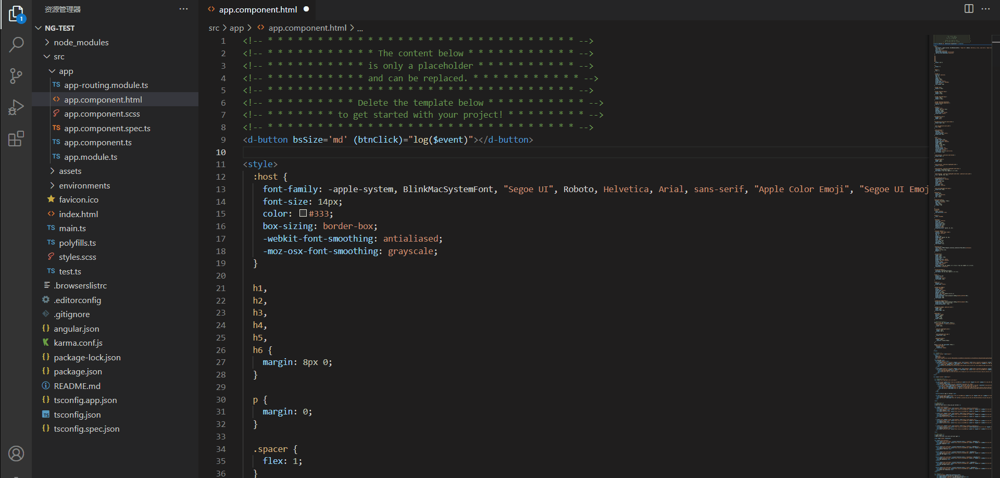

<a href="https://devui.design/home" target="_blank" rel="noopener noreferrer">

  
 
  
  
  
  

<h1 align="center">DevUIHelper for DevUI Component</h1>
DevUIHelper为 <a href="https://devui.design/components/get-start" target="_blank">DevUI组件库</a>使用者提供更快捷，更丝滑的代码开发体验

## 插件特点

###  代码提示补全
为组件和指令提供了代码自动补全功能，自动补全必选参数，提供组件/指令支持的所有API信息进行选择

### 悬浮提醒
提供悬浮提示信息，包括使用场景，支持API列表，API详情等关键信息

### 代码纠错
- 在使用devui内容且未安装devui时报警。
- 在devui标签下没有输入必要内容时报警。

## 开发调试
- 在根目录运行`npm install`。
- 运行 `npm run compile`编译客户端和服务器
- 切换到调试视图。
- 从下拉列表中选择 `Launch Clien`。
- 运行启动配置。
- 如果您还想调试服务器，请使用启动配置`Attach to Server`

## 贡献

欢迎贡献您的代码或者讨论您的好点子！

感谢所有帮助我们构建DevUI的贡献者
